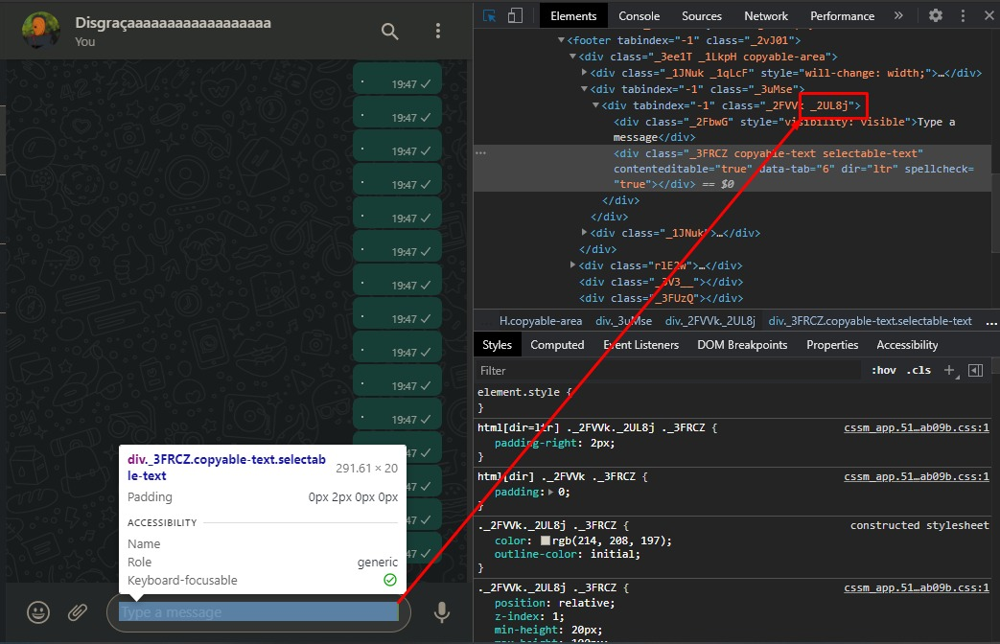

<div align="center">
     
</div>

<br>
<br>

# BOT WHATSAPP

This is a bot for spam on whatsapp 🤣🤣🤣

<br>
<br>

## How to use

```
    const recipient = "Tia"
    // -> the person that you will send message
    const messageSent = "Bom dia"
    // -> the message
    const objectInput = "div._2UL8j"
    // -> not change this, just if don't work, possible solution below
```

<br>
<br>

## Troubleshooting

```
TypeError: Cannot read property 'focus' of null
    at main (C:\www\botjswhatsapp\index.js:22:22)
    at processTicksAndRejections (node:internal/process/task_queues:93:5)
```

If apear this error to you, open developer tools of google -> elements -> go to input of whatsapp web, get the class and change on const



<br>
<br>

## Ref

- Video <a href="https://youtu.be/Cml20VkyB_A">Link</a>
- author: <a href="https://github.com/machadop1407">@machadop1407</a>

<br>
<br>
<br>

Made with :heart: by <a href="https://github.com/miguelrisquelme" target="_blank">Miguel Riquelme</a>
